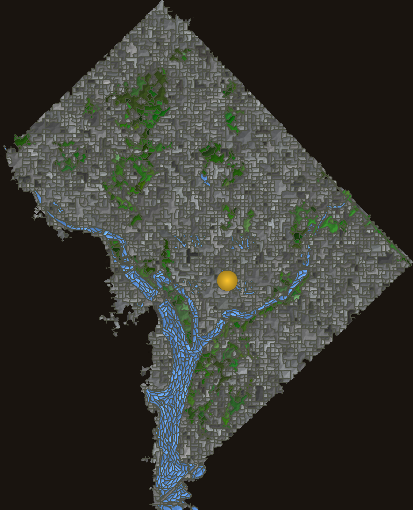

# Green Map — Washington, DC

A procedurally generated mosaic "Green Map" of Washington, DC, in the spirit of **Ellen
Harvey's _Green Map_ (2019)** in the lobby of the Grand Hyatt at SFO. Harvey's piece inverts
the usual map: water becomes a shimmering field, parks are jewels, developed land recedes,
and a small gold disc marks "you are here."

This repo builds the DC version the same way Harvey's reads — three distinct families of
hand-cut-looking tiles — but every visual property (tile shapes, sizes, grout, colours) is
**measured from a photo of the real SFO mosaic and matched numerically**, not eyeballed.



- **grey land** — small rectangular tesserae
- **green parks** — big interlocking glass shards (Rock Creek, the Mall, the Arboretum, …)
- **blue water** — tiles elongated *along the river current* (Potomac & Anacostia)
- **gold disc** — the Capitol, a single smooth object

The District outline, the rivers, and the (major) green space are read from a real satellite
image, so the shape is the true post-1846-retrocession DC (only the N and E corners of the
original diamond survive; the Potomac is the western boundary).

## Generate it

Requires `python3` with `numpy`, `scipy`, `Pillow`, `contourpy` (and `matplotlib` for the
analysis tools).

```bash
./generate.sh                 # render the PNG + export the interactive viewer data
# or individually:
python3 src/render_map.py 1600        # -> output/dc_greenmap.png  (arg = height in px)
python3 src/export_tiles.py           # -> web/dc_tiles.js  (for the viewer)
open web/viewer.html                  # interactive: grout, brightness, water shimmer, colours
```

## Repo layout

```
data/        inputs (committed so it's reproducible)
  dc_satellite.jpg   real DC satellite — source of the outline, rivers, green space
  sfo_greenmap.jpg   close-up of Harvey's SFO mosaic — source of all the metrics & colours
  color_model.json   per-region colour palettes sampled from the SFO photo
src/         THE GENERATOR (what's used)
  dc_build.py        engine: region map + 3 tile families + colour + shading
  render_map.py      -> output/dc_greenmap.png
  export_tiles.py    -> web/dc_tiles.js
web/         viewer.html (interactive), dc_tiles.js, gallery.html, sliders-demo.html
output/      dc_greenmap.png (the finished piece)
tools/       analysis & verification — how the numbers were derived/checked (see below)
```

## How it works (the method)

The whole project is one idea: **don't guess what "mosaic-y" means — measure it from the
real artwork, then generate to those numbers.**

1. **Segment** the real SFO photo into individual tiles (gradient-watershed; `tools/seg.py`).
2. **Measure** each tile with a shared yardstick (`tools/metrics.py`): area, size-variation
   (`area_cv`), `solidity` (interlocking), `circularity`/right-angle corners (rectangularity),
   colour. These targets live in `tools/sfo_target_metrics.json`.
3. **Generate** three tile families and tune each until its metrics match the real ones:

| family | model (`src/dc_build.py`) | key matched metrics (real → gen) |
|---|---|---|
| grey land | deformed quad grid + cluster-merge | right-angle corners 44% → 41%, area-cv 1.03 → 1.10 |
| green parks | warped variable-density Voronoi + merge | solidity 0.79 → 0.73, area-cv 1.96 → 1.5 |
| water | flow-elongated cells along the current | — |
| green/grey size ratio | — | 1.14 → 1.15 |

4. **Grout** is rendered at the measured width (**8% of tile diameter**) in the measured
   colour (**warm grey, not black**); colours are sampled per region from the real palettes.

Verify any time:

```bash
python3 tools/compare_metrics.py     # generated vs real, per family
python3 tools/rectangularity.py      # corner-angle distribution (the "squareness" metric)
python3 tools/area_ratio.py          # green/grey area ratio
```

## tools/ — analysis & the journey

Kept, runnable (run from the repo root):

- `seg.py` — mosaic segmentation (grout = gradient ridges, markers = flat tile interiors).
- `metrics.py` — per-tile shape metrics; the shared yardstick.
- `compare_metrics.py`, `rectangularity.py`, `area_ratio.py` — verify generated ≈ real.
- `extract_shapes.py` — vectorise the real tiles into polygons (`tile_shapes.json`).
- `color_model.py` — sample the real per-region palettes → `data/color_model.json`.
  (Run `extract_shapes.py` first; it produces the `tile_shapes.json` this reads.)

`tools/experiments/` — earlier approaches we built and learned from, kept as a record (paths
may point at the old layout). The story of these:

- **`generate.py` (Voronoi), `fracture.py`, `bricks.py`** — generative tile models. We learned
  Voronoi *cannot* reproduce the green shards (too convex, too uniform), which forced the
  fracture model. Bricks/flow-bricks explored rectangular backgrounds.
- **`tune.py`, `tune_green.py`, `fit_all.py`** — parameter searches fitting those models to
  the measured metrics.
- **`segment_real.py`, `discriminate_green.py`, `characterize_shapes.py`** — measuring the real
  tiles, finding which metrics actually separate the families, and a PCA shape model.
- **`compare_visual.py`, `strategies.py`** — side-by-side bake-offs of tiling strategies
  (transplanting real shapes vs generating them). The transplant route was the most faithful
  but couldn't tile seamlessly, which led to the current generate-to-metrics approach.
- **`grout.py`, `debug_seg.py`** — measuring grout width/colour and debugging segmentation.

Also in `web/`: `gallery.html` (a 7-technique mosaic explainer) and `sliders-demo.html` (an
earlier live-tweak DC generator) — standalone, no build step.

## Credit

Concept and the original mosaic: **Ellen Harvey, _Green Map_ (2019)**, Grand Hyatt at SFO,
commissioned by the San Francisco Arts Commission.
