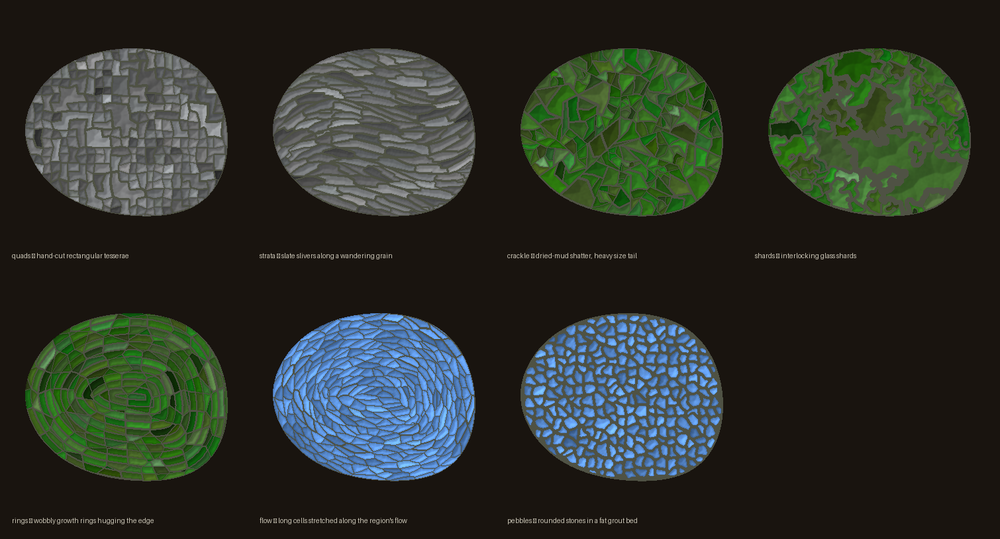

# US Mosaic Maps

Procedurally generated mosaic maps of **every US state and the country as a whole**, in the
style of Ellen Harvey's _Green Map_ (2019) at the Grand Hyatt at SFO. Each region class —
land, parks, water — is rendered in its own family of hand-cut-looking tiles, and you choose
which shape family fills each one.

> **🔗 Live site: [us-mosaic-greenmap.netlify.app](https://us-mosaic-greenmap.netlify.app)**

The site loads on a mosaic of the whole United States (Albers projection, Alaska & Hawaii as
insets); **click any state** to drill into it, and pick a shape family for **land / parks /
water** to re-tile the map live.



It started as a single map of Washington, DC (see [Origins](#origins-the-dc-green-map) below) —
the specific idea taken from Harvey's piece is one principle:

> **different shape distributions for different colours** — each kind of region gets its own
> family of tiles, not just its own colour. Two families are tuned to shape metrics *measured*
> from a photo of the real SFO mosaic; the rest are our own.

## Quick start

Requires `python3` with `numpy`, `scipy`, `Pillow` (and `matplotlib` for the DC analysis tools).
No other dependencies — all map data is fetched from public ArcGIS endpoints with the stdlib.

```bash
# one state -> output/<state>_greenmap.png
python3 src/make_state.py Maryland
python3 src/make_state.py Michigan --water pebbles --green crackle --height 2000
python3 src/make_state.py --list                  # the shape families

# one state, every shape combo, as a browsable page
python3 src/gallery.py Michigan                   # -> output/gallery/michigan/index.html

# the whole interactive site: all 50 states + DC, then the national aggregate
python3 src/build_site.py --all --format webp     # -> output/site/<state>/...
python3 src/build_national.py --height 900         # -> adds the clickable "United States" map
open output/site/index.html
```

`make_state.py` flags: positional `state` (full name or 2-letter code), `--land/--green/--water`
(any family), `--height` (default 1600), `--seed`, `--no-capital`, `--list`.

## The shape families

Every family is a hand-rolled generative *process* (no pattern book), built from standard
primitives — jittered grids, Voronoi, distance transforms, noise fields, PCA. `python3
src/families.py` writes the contact sheet above.

| family | look | how it's made |
|---|---|---|
| `quads` | hand-cut rectangular tesserae | deformed quad lattice + cluster-merge *(SFO-calibrated)* |
| `shards` | interlocking glass shards | warped variable-density Voronoi + merge *(SFO-calibrated)* |
| `flow` | cells stretched along the current | anisotropic Voronoi oriented by the water's flow field |
| `pebbles` | rounded stones in a fat grout bed | eroded + smoothed Voronoi, gaps become grout |
| `strata` | slate slivers along a wandering grain | oriented anisotropic Chebyshev cells |
| `crackle` | dried-mud shatter, heavy size tail | recursive PCA-axis jagged cuts (a fracture model) |
| `rings` | wobbly growth rings hugging the edge | warped distance-transform bands, segmented |
| `disc` | one smooth piece | the gold capital locator |

Defaults: `land=quads`, `green=shards`, `water=flow`. `quads`/`shards` are tuned to the real
SFO mosaic's measured corner-angle and size distributions; the rest are our own inventions.

## Real geography, made legible

The maps are accurate where it matters and stylized where it helps:

- **Real boundaries.** State outlines, hydrography, and protected areas come from public data
  (below), not from a satellite image. Each state uses its true outline and aspect ratio; the
  national map uses an **Albers Equal-Area** projection (the USGS standard, so the country
  isn't north-south stretched).
- **Tiles auto-scale to the geography.** Tile size keys off each region's median width, so a
  narrow river isn't rendered with the same coarse tiles as a wide bay.
- **Grout is a constant fraction of each tile.** So a region reads the same "size" no matter
  which shape family fills it — thin water keeps its colour instead of dissolving into grout.
- **Honest tradeoffs.** At the chunky mosaic resolution, features smaller than ~1 tile (e.g.
  many of Minnesota's small lakes) fall below the grid — the price of the tesserae aesthetic.

### Data sources

Fetched on demand with stdlib `urllib` and cached under `data/cache/` (git-ignored):

- **State outlines & hydrography** — US Census **TIGERweb** (States, Areal Hydrography). The
  outline is the *legal* boundary, so a state owns its water (the Chesapeake, the Great Lakes
  halves); hydro polygons then carve the water back out.
- **Parks** — USGS **PAD-US** Management Areas, filtered to park/forest/refuge designations.
- **Capitals** — approximate city centers (gold locator disc).

## Repo layout

```
src/
  state_data.py    fetch + cache + rasterize any state -> region map (land/parks/water/capital)
  make_state.py    CLI: one state -> a PNG
  families.py      the shape vocabulary (8 families) + composer + renderer
  gallery.py       one state, all 343 family combos + an HTML browser
  build_site.py    every state -> output/site/ + the multi-state index page
  build_national.py  composite all states (Albers + AK/HI insets) -> the national map
  dc_build.py      the original DC engine (metrics-calibrated; left untouched)
  render_map.py / render_height.py / export_tiles.py   DC render + fabrication + viewer data
data/
  color_model.json   per-region colour palettes sampled from the SFO photo
  dc_satellite.jpg, sfo_greenmap.jpg   DC source image + the SFO mosaic photo (metrics)
  cache/             fetched GeoJSON per state (git-ignored)
output/
  site/, gallery/    generated galleries (git-ignored)
  *_greenmap.png     sample renders
tools/               DC analysis & verification — how the shape metrics were derived
```

## Origins: the DC Green Map

This began as a single procedural map of Washington, DC, reverse-engineering Harvey's mosaic.
The interesting part was the grey and green families: **rather than guessing what "hand-cut
tesserae" vs "interlocking shards" should look like, measure them from the real artwork and
generate to those numbers.** What "less rectangular" means turned out to be a *distribution of
corner angles* — not exact right angles, but many in the 80°–100° range.


| family | model (`src/dc_build.py`) | matched to SFO? (real → gen) |
|---|---|---|
| grey land | deformed quad grid + cluster-merge | yes — right-angle corners 44% → 41%, area-cv 1.03 → 1.10 |
| green parks | warped variable-density Voronoi + merge | yes — solidity 0.79 → 0.73, area-cv 1.96 → 1.5 |
| water | flow-elongated cells along the current | no — our own, designed by hand |

`dc_build.py` (and the DC render/fabrication/viewer scripts) are the original, left untouched;
`families.py` contains generalized copies. The full method, verification scripts, and the
experiments we learned from live in `tools/` (segmentation, per-tile metrics, parameter fits).

```bash
python3 src/render_map.py 1600        # -> output/dc_greenmap.png
python3 tools/compare_metrics.py      # generated vs real, per family
```

## Make a physical version

Turn a map into a tactile, raised object (outputs git-ignored — regenerate any time):

```bash
python3 src/render_height.py 1600         # -> colour print + 16-bit height map
python3 tools/make_coaster_mesh.py 100 1.0 3.5   # -> watertight full-colour relief mesh
```

- **Textured UV / "elevated" flatbed print** (best for large, ~30 cm): send a shop the colour
  image + the height map; ask for *elevated/textured* UV (Canon Touchstone, Arizona
  PRISMAelevate, Direct Color TEXTUR3D).
- **Full-colour 3D print** (best small): upload the coaster mesh to craftcloud3d.com or
  i.materialise; pick a full-colour material; set units to **millimetres**.

## Credit

Concept and the original mosaic: **Ellen Harvey, _Green Map_ (2019)**, Grand Hyatt at SFO,
commissioned by the San Francisco Arts Commission.
